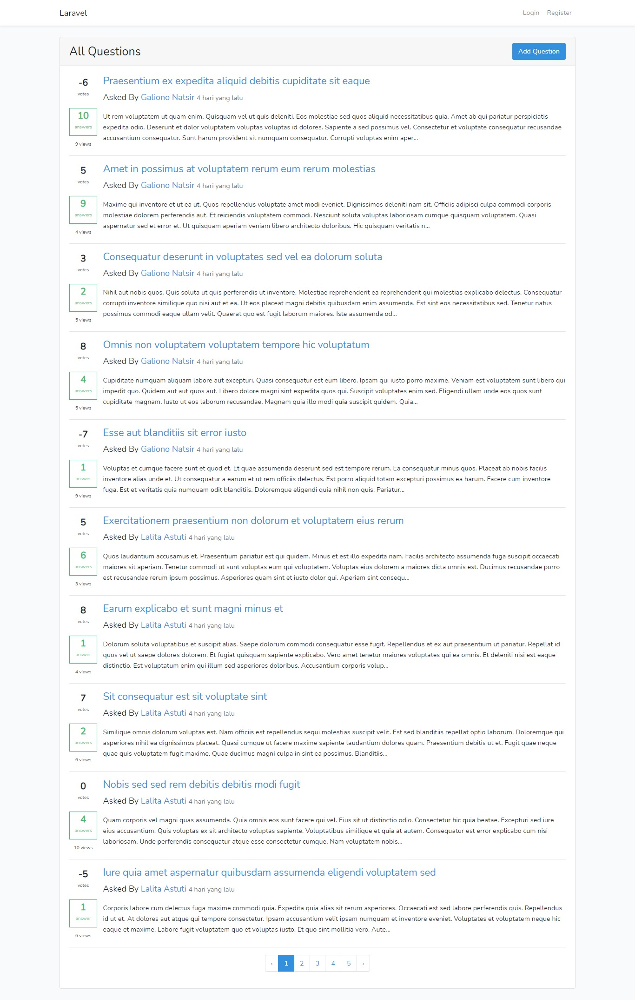
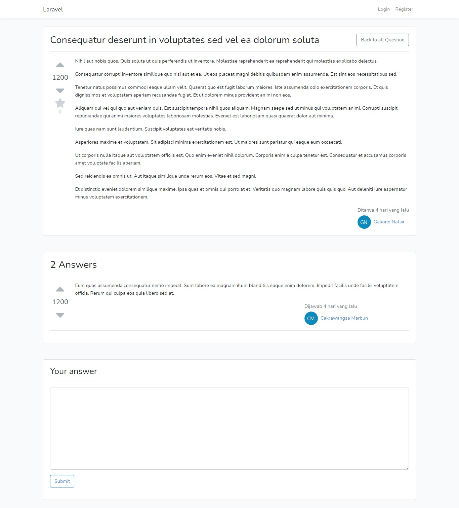

# Laravel QA Questions and Answer built with Laravel 6
Course from [Fullstack Vue and Laravel Course](https://www.udemy.com/course/laravel-vuejs-fullstack-web-development/)

This app is clone stackoverlow. this project still in development.

## Installation
how to install and setup in your machine?
  - Clone or download this project
  - Run `composer install`
  - Create database with name you want
  - Copy and paste .env.example become .env
  - Run `php artisan key:generate`
  - Run `php artisan migrate`
  - Run `php artisan db:seed`
  - Run `php artisan serve`

## Features
  - I will update it later

## Screenshoot

